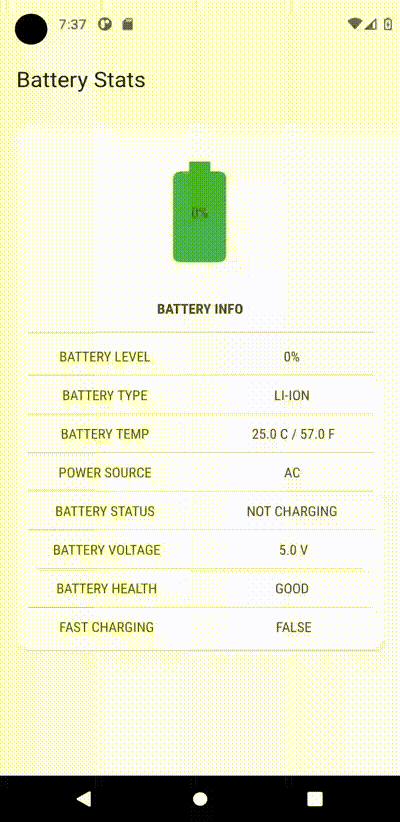

# BatteryStats-for-Android
Displays the Battery stats of an Android device using Broadcast receiver in Android Studio. Fully implemented in Jetpack compose using Material 3 dynamic theming and also has a separate implementation with xml.

&nbsp;
### Stats Displayed :
- Battery Level
- Battery type
- Battery temp(in C and F)
- Charging Power Source
- Status
- Battery Voltage
- Battery Health 
- Fast charging

&nbsp;
### Preview : 
